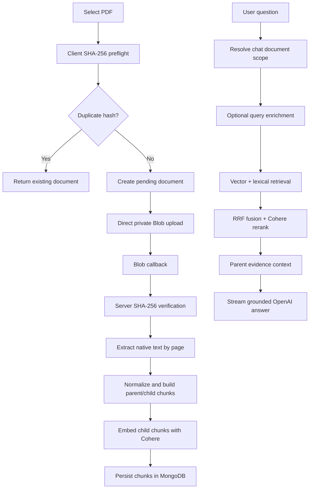

# DocChat

DocChat is a full-stack Next.js document intelligence app for asking grounded questions over native-text PDF files.

## Implemented Scope

- PDF upload with type and 10 MB size validation.
- Client SHA-256 preflight, duplicate detection, then direct browser-to-Vercel Blob upload for files beyond API route payload limits.
- Private Blob storage with scoped upload tokens, Blob callback handling, and backend SHA-256 verification before ingestion.
- MongoDB Atlas persistence for sessions, workspaces, documents, chunks, chats, and messages.
- Page-aware RAG ingestion: PDF text extraction, conservative normalization, parent/child chunking, Cohere embeddings, and Atlas indexing.
- Hybrid retrieval: Atlas Vector Search, Atlas lexical Search, RRF fusion, Cohere reranking, then parent evidence expansion.
- Streamed chat answers through `POST /api/chat` using OpenAI Responses API.
- Source display with persisted source chunk IDs, rerank scores, document names, page ranges, and excerpts.
- Authenticated workspace access with session and signed workspace cookies.
- Multi-document chat scope, duplicate PDF detection by SHA-256, same-name renaming, processing cancellation, retry, and delete handling.
- French and Arabic PDF support for extraction, retrieval, and answers.
- Focused Vitest coverage for chat policy, prompt construction, chunking, fusion, and document actions.
- Manual RAG evaluation set with expected and observed answers.

Rate limiting and structured logging are intentionally left out of the current delivery to keep the implementation focused.

## Stack

- Next.js, React, TypeScript strict mode
- MongoDB Atlas and Atlas Search
- Vercel Blob
- Cohere SDK for embeddings and reranking
- OpenAI Responses API for enrichment, title generation, and streamed answers
- Vitest

## RAG Shape



## Local Setup

```bash
npm install
npm run verify
npm run setup
npm run dev
```

Create `.env.local` from `.env.example` before running setup. Full instructions are in [docs/setup.md](docs/setup.md).

## Validation

```bash
npm test
npm run typecheck
npm run lint
```

## Documentation

- [Setup](docs/setup.md)
- [Architecture Index](docs/README.md)
- [RAG Pipeline](docs/architecture/rag/pipeline.md)
- [Document Ingestion](docs/architecture/documents/ingestion.md)
- [Chat Answering](docs/architecture/chat/answering.md)
- [Evaluation Questions](evaluation/README.md)
