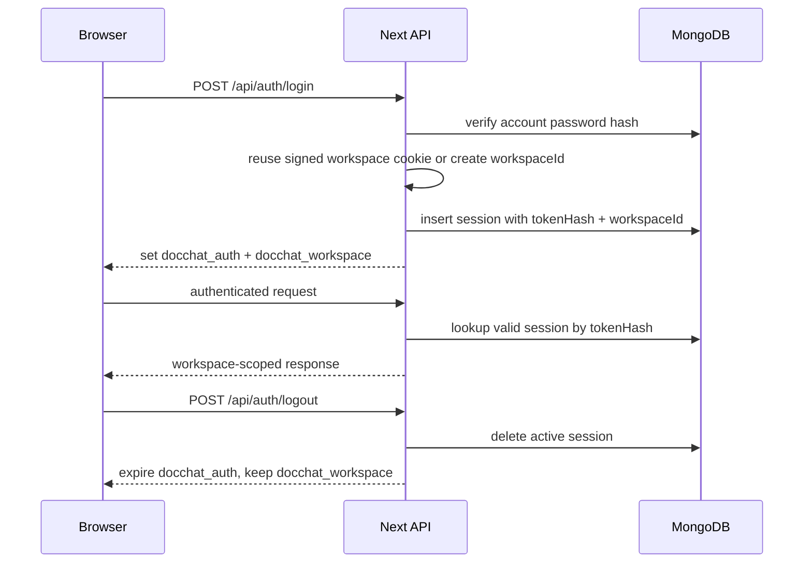

# Auth, Session, Workspace

The shared account gates access. The workspace ID isolates browser data for chats, documents, chunks, and messages.

## Cookies

| Cookie | Purpose | Cleared On Logout | HttpOnly |
| --- | --- | --- | --- |
| `docchat_auth` | Authenticates the current session. | Yes | Yes |
| `docchat_workspace` | Preserves browser workspace identity. | No | Yes |

`docchat_auth` stores a raw opaque token. MongoDB stores only `SHA-256(raw token)` in `sessions.tokenHash`.

`docchat_workspace` stores `workspaceId.signature`. The signature is `HMAC-SHA256(SESSION_SECRET, "docchat_workspace:{workspaceId}")`.

Deleting the workspace cookie loses the browser's link to that workspace. The data remains in MongoDB, but future login from that browser creates a new workspace unless the old cookie value is restored.

## Flow

## Rules

- `SESSION_SECRET` signs workspace cookies only.
- Passwords use Argon2id.
- Session tokens are random bearer tokens and are never stored raw.
- API routes resolve workspace from the valid auth session, not directly from the workspace cookie.
