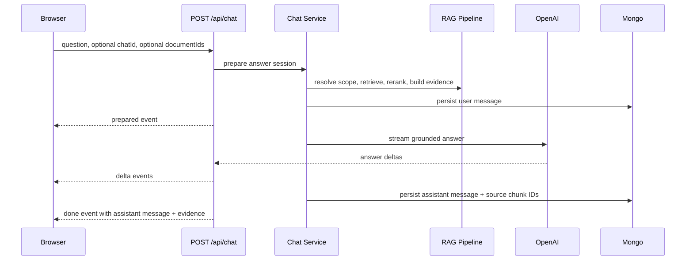

# Chat Answering

Chats are workspace-scoped and own a persistent/default document scope. The answer path streams the assistant response through `POST /api/chat`.

## Responsibilities

- `lib/chat/` owns chat preparation, message persistence, and answer orchestration.
- `lib/rag/` owns retrieval, reranking, evidence context, and answer generation.
- The frontend allows one active answering request at a time.

Chat navigation is disabled while an answer is running. The document panel remains accessible.

## Document Scope

`Chat.documentIds` is the persistent/default document scope of a conversation. It references workspace documents attached to the chat, not the documents used by the latest query.

Selected documents are attached to `Chat.documentIds` when the user sends a non-empty message. That request answers from the selected documents only.

If an existing-chat request omits `documentIds`, retrieval falls back to `Chat.documentIds` and may contextualize the question with recent history.

| Request | Retrieval scope | Query enrichment |
| --- | --- | --- |
| New chat, no documents | Rejected. | None. |
| New chat, selected documents | Selected ready documents. | None. |
| Existing chat, selected documents | Selected ready documents. | None. |
| Existing chat, no selected documents | Stored `Chat.documentIds`. | Bounded recent history. |

## Current Frontend Policy

- New chat requires non-empty text and at least one selected ready document.
- Existing chat requires non-empty text.
- Draft selected documents clear when a send starts and restore only if the request fails.
- Multi-chat concurrent answering is not part of the current interaction model.
- Streaming preserves the same scope, persistence, and source rules.

## Streaming Flow

