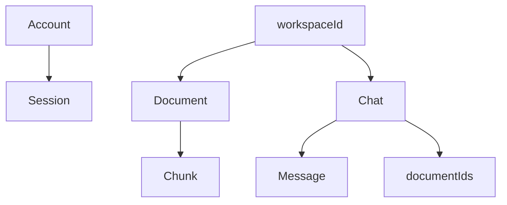

# Data Model

MongoDB Atlas stores application state. There is no `workspaces` collection; `workspaceId` is a persistent isolation key carried by workspace-owned records.

## Ownership

Every document, chunk, chat, and message operation must enforce workspace ownership.

## Collections

### `accounts`

- `_id: ObjectId`
- `email: string`
- `passwordHash: string`
- `createdAt: Date`

Rules: lowercase email, Argon2id password hash, unique email.

### `sessions`

- `_id: ObjectId`
- `accountId: ObjectId`
- `workspaceId: string`
- `tokenHash: string`
- `createdAt: Date`
- `expiresAt: Date`

Rules: one login creates one session, several sessions may share a workspace, raw tokens never enter MongoDB.

### `documents`

- `_id: ObjectId`
- `workspaceId: string`
- `name: string`
- `contentHash: string`
- `blobPathname?: string`
- `sizeBytes: number`
- `pageCount?: number`
- `status: "pending_upload" | "processing" | "ready" | "failed"`
- `stage?: "reading" | "normalizing" | "chunking" | "embedding" | "indexing"`
- `progress?: number`
- `error?: { code: string; message: string }`
- `processingLock?: { token: string; expiresAt: Date }`
- `createdAt: Date`
- `updatedAt: Date`

Rules: workspace-scoped storage, `(workspaceId, contentHash)` deduplication, stable Blob pathname, short-lived processing lock.

### `chunks`

- `_id: ObjectId`
- `documentId: ObjectId`
- `strategyVersion: string`
- `kind: "parent" | "child"`
- `text: string`
- `tokenCount: number`
- `parentId?: ObjectId`
- `sectionPath?: string[]`
- `pageStart: number`
- `pageEnd: number`
- `startOffset?: number`
- `endOffset?: number`
- `language: "fr" | "ar" | "mixed"`
- `embedding?: number[]`

Rules: child chunks are retrieval units, parent chunks provide context, workspace ownership resolves through `documentId`.

### `chats`

- `_id: ObjectId`
- `workspaceId: string`
- `title: string`
- `documentIds: ObjectId[]`
- `createdAt: Date`
- `updatedAt: Date`

Rules: `documentIds` is the persistent/default chat scope; per-query selection does not mutate it.

### `messages`

- `_id: ObjectId`
- `chatId: ObjectId`
- `role: "user" | "assistant"`
- `content: string`
- `status: "streaming" | "completed" | "failed"`
- `sources?: { chunkId: ObjectId; relevanceScore: number }[]`
- `createdAt: Date`

Rules: messages are separate from chats; source display data resolves through chunk and document records.
