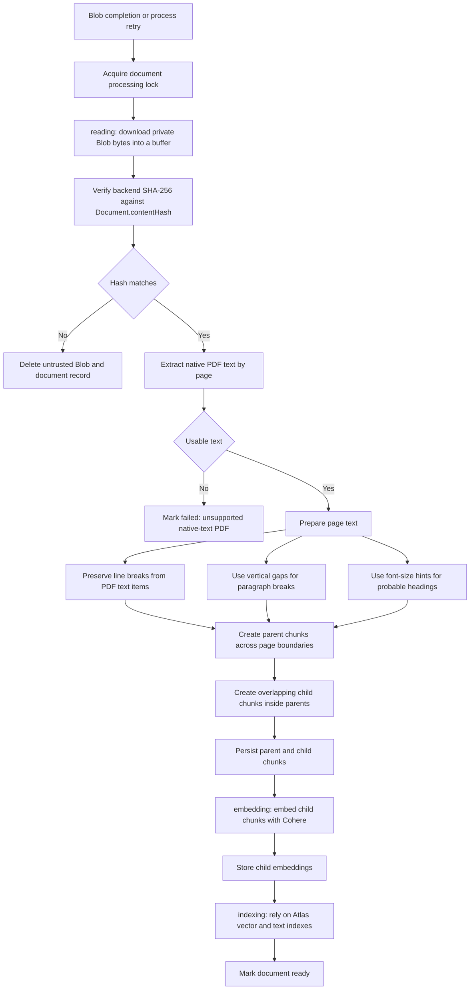

# Document Ingestion

Document ingestion turns a verified private Blob PDF into searchable MongoDB chunks.

## Entry Points

| Entry | Purpose |
| --- | --- |
| Blob completion callback | Starts ingestion after direct upload succeeds. |
| `POST /api/documents/{documentId}/process` | Retries or resumes processing for uploaded documents. |

## Durable Stages

| Stage | Work |
| --- | --- |
| `reading` | Read Blob bytes, verify hash, extract text, normalize pages, create chunks. |
| `embedding` | Embed child chunks with Cohere `search_document`. |
| `indexing` | Finalize indexed data and mark the document ready. |

Reading preserves citation-critical structure: page numbers, line breaks, paragraph gaps, probable headings, and clear failure for unsupported native-text extraction.

## Flow

## Indexing Surface

| Index | Use |
| --- | --- |
| Atlas Vector Search | Dense retrieval over child embeddings filtered by document, kind, and strategy. |
| Atlas Search | Lexical retrieval over child text with standard, French, and Arabic analyzers. |

## Rules

- Scanned or unsupported PDFs fail clearly.
- Hash mismatch deletes the uploaded Blob and document record.
- Cancellation is checked between durable stages.
- Retry resumes from the stored durable stage.
- Parent chunks provide answer context; child chunks drive retrieval.
