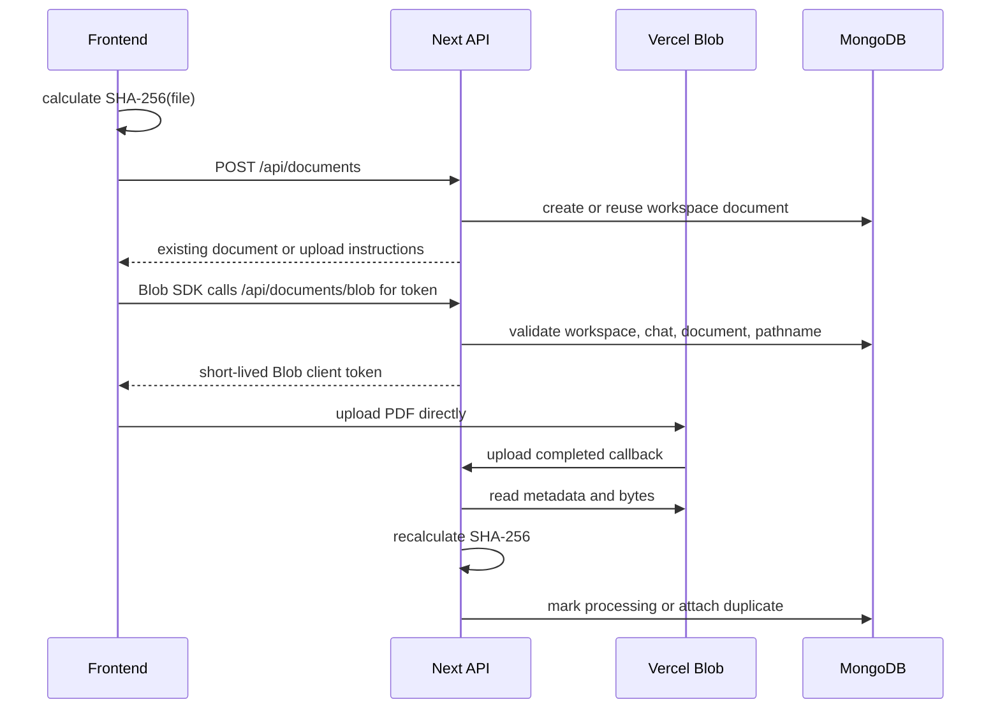

# Document Upload

PDF bytes are uploaded directly from the browser to private Vercel Blob storage. The backend owns authorization, metadata validation, deduplication, and completion verification.

## Routes

| Route | Caller | Purpose |
| --- | --- | --- |
| `POST /api/documents` | Frontend | Upload preflight, document reuse, Blob upload instructions. |
| `POST /api/documents/blob` | Vercel Blob SDK and Blob service | Client upload token generation and upload completion callback. |
| `GET /api/documents` | Frontend | Workspace document library listing. |
| `GET /api/documents/{documentId}/status` | Frontend | Status polling. |
| `DELETE /api/documents/{documentId}?chatId=...` | Frontend | Detach document from a chat. |
| `DELETE /api/documents/{documentId}` | Frontend | Delete document from the workspace library. |

## Flow



## Local Callback Testing

Blob callbacks cannot reach `localhost`. For local testing, expose the dev server with a public tunnel and set `VERCEL_BLOB_CALLBACK_URL` before starting Next.js.

```bash
ngrok config add-authtoken <token>
ngrok http 3000
npm run dev
```

`VERCEL_BLOB_CALLBACK_URL` is local-only and should not be pushed as a deployment value.

## Rules

- The browser never sends PDF bytes through the Next.js request body.
- Upload preflight accepts metadata only: `chatId`, `name`, `sizeBytes`, `contentHash`.
- Documents are workspace assets and can exist without a chat reference.
- Existing workspace documents are reused by `(workspaceId, contentHash)`.
- Blob pathnames are stable: `documents/{documentId}/original.pdf`.
- Backend hash verification is authoritative.
- Hash mismatch deletes the uploaded Blob and document record.
- Detaching from a chat does not delete the workspace document.
- Global delete removes the document from all chats, then deletes chunks, Blob, and document record.
