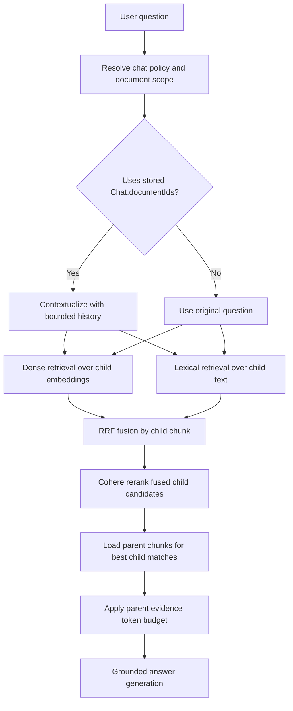

# RAG Pipeline

The production path is `page-parent-child-v1`. It extracts native PDF text by page, chunks page-grounded text into parent and child chunks, embeds child chunks, retrieves child evidence, reranks it, expands to parent evidence, and generates a grounded answer.

## Responsibilities

- `config/rag.ts` owns the strategy map, chunk limits, retrieval limits, model references, and progress anchors.
- `lib/rag/ingestion/` owns document ingestion orchestration.
- `lib/rag/extraction/` owns PDF text extraction and page provenance.
- `lib/rag/chunking/` owns strategy-versioned chunking.
- `lib/rag/embeddings/` owns Cohere embedding calls.
- `lib/rag/retrieval/` owns dense retrieval, lexical retrieval, and fusion.
- `lib/rag/reranking/` owns Cohere reranking.
- `lib/rag/context/` owns parent evidence context and evidence budgeting.
- `lib/rag/answer/` owns grounded OpenAI prompt construction and answer streaming.

## Provider Boundary

Provider SDKs are used directly at integration points:

- Cohere SDK for embeddings and reranking.
- OpenAI Responses API for query enrichment, title generation, and streamed answers.
- MongoDB Atlas Search for vector and lexical retrieval.

The RAG architecture stays explicit because core behavior is project-specific:

- PDF extraction preserves page numbers, line breaks, headings, and native-text failure behavior.
- Chunking is custom parent/child, page-aware, and strategy-versioned.
- Retrieval mixes Atlas vector search, Atlas lexical search, RRF fusion, Cohere reranking, then parent expansion.
- Document scope depends on chat policy: explicit selected documents or stored `Chat.documentIds`.
- Persistence needs exact Mongo records, lock-aware ingestion, cancellation, retry, source hydration, and workspace authorization.

## Ingestion Contract

See `documents/ingestion.md` for the full PDF-to-chunks flow.

Blob completion schedules ingestion with Next.js `after()` so the upload callback response stays fast.

`processDocument()` acquires the document processing lock, then calls the RAG ingestion runner with `workspaceId`, `documentId`, and `lockToken`.

The ingestion runner updates `Document.status`, `stage`, and `progress` through document lifecycle helpers. It releases the processing lock when the run finishes or fails.

The ingestion runner reads the private Blob, verifies SHA-256, extracts page text, normalizes it, creates parent/child chunks, embeds child chunks, and marks the document ready after successful persistence.

## Retrieval Contract

Retrieval filters by workspace, selected document IDs, chunk kind, and strategy version.

## Strategy

`page-parent-child-v1` uses:

- parent target `1600`, max `2200`;
- child target `600`, max `750`, overlap `80`;
- dense top `20`, lexical top `20`, fused top `24`, rerank top `8`;
- evidence budget `8000` tokens;
- Cohere `embed-v4.0` with 1024 dimensions;
- Cohere `rerank-v4.0-pro`;
- OpenAI `generation` model for final answers and `auxiliary` model for contextualization and titles.
