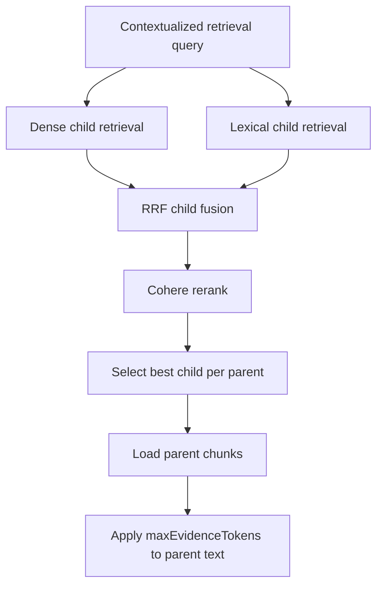

# Retrieval And Ranking

Retrieval combines dense vector search and MongoDB Atlas lexical search, then deduplicates and reranks candidates.

## Responsibilities

- Query contextualization rewrites dependent follow-up questions only when needed.
- Dense retrieval embeds the contextualized retrieval query with Cohere and searches MongoDB Atlas Vector Search.
- Lexical retrieval uses the contextualized retrieval query with MongoDB Atlas Search and French/Arabic analyzers.
- Candidate fusion uses Reciprocal Rank Fusion and deduplicates child chunks before reranking.
- Cohere reranking receives the retrieval query and fused child candidate texts.
- Parent evidence is loaded after reranking.

Retrieval must always filter by current workspace and selected document IDs.

## Implementation Boundary

LangChain wraps Cohere embeddings and reranking. MongoDB vector search, lexical search, RRF fusion, parent expansion, context budgeting, and workspace filtering stay explicit application code.

## Flow



## Conversational Context

A bounded recent history window is used for both the contextualizer and final answer generation:

```text
last 2 complete user/assistant turns
current question
token ceiling around 1,500 tokens
```

The contextualizer returns:

```ts
{
  needsRewrite: boolean;
  retrievalQuery: string;
}
```

The `retrievalQuery` is internal and is used for embedding, lexical search, and reranking. Final generation still receives the original user question, bounded conversation history, and retrieved parent evidence.

## Scoring

| Score | Use |
| --- | --- |
| Dense score | Diagnostics. |
| Lexical score | Diagnostics. |
| RRF fused score | Candidate merge and diagnostics. |
| Rerank score | Primary evidence ordering signal. |

## Limits

| Step | Limit |
| --- | --- |
| Dense retrieval | `20` results from `100` candidates |
| Lexical retrieval | `20` results |
| RRF fusion | `24` candidates |
| Cohere rerank | `8` children |
| Evidence context | `8000` parent tokens |
